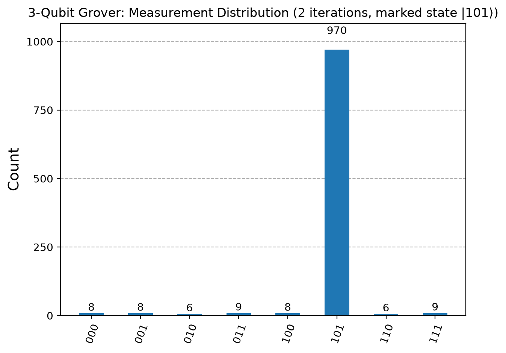

# Quantum Algorithms Foundations

A computational introduction to fundamental quantum algorithms implemented using **Python** and **Qiskit**.

This project explores the connection between the mathematical ideas behind quantum algorithms and their implementation as quantum circuits. The notebooks cover superposition, entanglement, quantum interference, phase kickback, quantum oracles, and amplitude amplification through small-scale simulations.

---

## Notebooks

| Notebook | Topic | Main concepts |
|---|---|---|
| `01_bell_state.ipynb` | Bell State | Superposition, entanglement, measurement |
| `02_deutsch_algorithm.ipynb` | Deutsch's Algorithm | Quantum interference, phase kickback |
| `03_deutsch_jozsa_nqubit.ipynb` | Deutsch-Jozsa Algorithm | Constant and balanced functions |
| `04_grover_2qubit.ipynb` | Grover's Algorithm | Oracle, diffusion, amplitude amplification |
| `05_grover_3qubit.ipynb` | Grover's Algorithm | Search spaces, iteration count, validation |

The notebooks are presented in a logical progression from basic quantum states and circuits to multi-qubit quantum algorithms.

---

## Key Results

### Bell State

The Bell-state simulation produced only the `00` and `11` measurement outcomes, as expected for

$$
|\Phi^+\rangle =
\frac{1}{\sqrt{2}}(|00\rangle + |11\rangle).
$$

For 1000 shots:

~~~
{'11': 514, '00': 486}
~~~

### Deutsch-Jozsa

The implementation was tested for $n=2$, $3$, and $4$ qubits. The constant and balanced oracles produced the expected measurement behaviour.

### Grover's Algorithm

For the 3-qubit example, the marked state was

$$
|101\rangle
$$

and two Grover iterations were used.

The simulation gave:

~~~
{'101': 970,
 '111': 9,
 '010': 6,
 '000': 8,
 '011': 9,
 '110': 6,
 '001': 8,
 '100': 8}
~~~

This corresponds to a measured probability of

$$
\frac{970}{1024}\approx94.7\%.
$$

The result is close to the theoretical success probability of approximately $94.5\%$.

---

## Technologies

- **Python**
- **Qiskit**
- **Qiskit Aer**
- **Matplotlib**
- **Jupyter Notebooks**

The circuits are evaluated using an ideal quantum simulator.

---

## Repository Structure

~~~
quantum-algorithms-foundations/
│
├── assets/
│   ├── bell_state_histogram.png
│   ├── grover_2qubit_histogram.png
│   └── grover_3qubit_histogram.png
│
├── notebooks/
│   ├── 01_bell_state.ipynb
│   ├── 02_deutsch_algorithm.ipynb
│   ├── 03_deutsch_jozsa_nqubit.ipynb
│   ├── 04_grover_2qubit.ipynb
│   └── 05_grover_3qubit.ipynb
│
├── .gitignore
├── LICENSE
├── README.md
└── requirements.txt
~~~

---

## Getting Started

Clone the repository and install the dependencies:

~~~bash
git clone https://github.com/lauraocanaa/quantum-algorithms-foundations.git
cd quantum-algorithms-foundations
pip install -r requirements.txt
~~~

Launch Jupyter:

~~~bash
jupyter notebook
~~~

Then open the notebooks in the `notebooks/` directory.

---

## Scope

This project focuses on small-scale, ideal simulations designed to make the underlying algorithms and their circuit implementations easy to inspect and understand.

Possible extensions include testing the circuits on real quantum hardware, introducing noise models, and extending the algorithms to larger systems.

---

## License

This project is licensed under the terms of the license included in this repository.